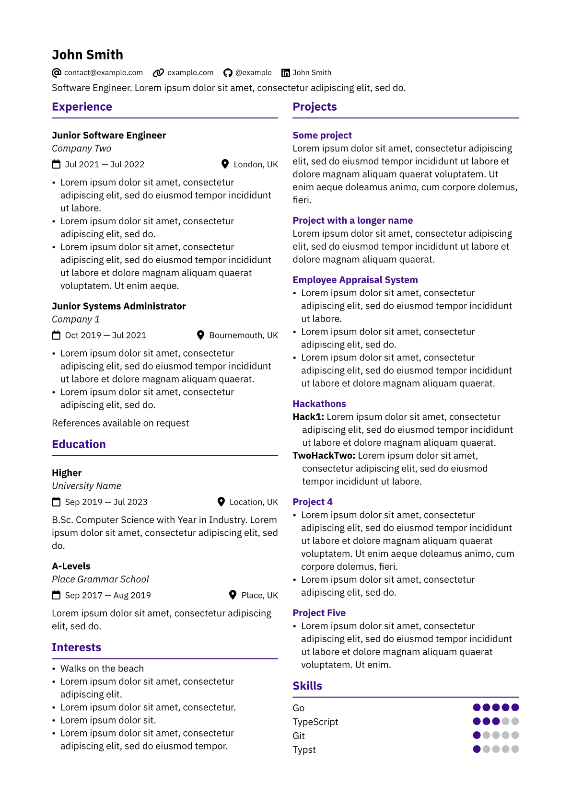

# Alta Typst

A simple Typst CV template, inspired by [AltaCV by LianTze Lim](https://github.com/liantze/AltaCV). [LaurenzV's simplecv](https://github.com/LaurenzV/simplecv) was used as a Typst code reference. See [`example.pdf`](example.pdf) for the rendered PDF output.

</img>

The layout is two columns, with one wrapping into the next when space runs out. If you'd like to force an early column or page break, you can use the `#colbreak()` command.

## Usage

### On [typst.app](https://typst.app/)

Upload both the `.typ` files and the `icons/` folder to your Typst project, then see `example.typ`. Uploading folders to the web app is unsupported, but you can select multiple files at once.

### With [Typst CLI](https://github.com/typst/typst)

Fork and clone this repo, then run `typst watch example.typ`.

Note that the template is intended for use with the IBM Plex Sans font, which isn't currently bundled with the Typst CLI — so the rendered output on your machine may differ slightly. You can run `typst fonts` to see which fonts can be used instead.

### Icons

Add extra icons by uploading more `.svg` files to the `icons/` folder. The existing icons are from [Font Awesome](https://fontawesome.com/search?o=r&m=free). You can then reference their file names as the `name` values in the `links` array passed into the `alta` function.

## Licence

[MIT](./LICENSE)

Icons are from Font Awesome, subject to [their terms](https://github.com/FortAwesome/Font-Awesome/blob/6.x/LICENSE.txt).
